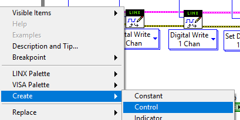
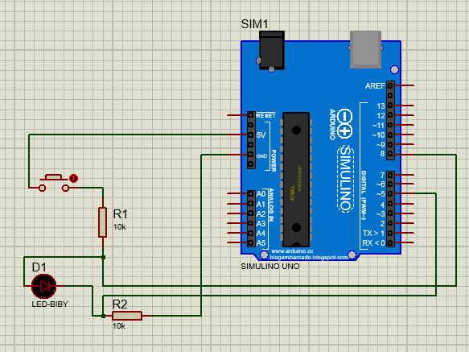
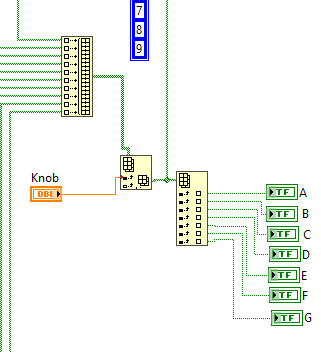

# Control-de-procesos

### *Índice*
- [Introducción a LabVIEW](#introducción-a-labview).
- [Practica 1](#Practica-1).
- [Practica 2](#Practica-2).
- [Practica 3](#Practica-3).
- [Practica 4](#Practica-4).
- [Practica 5](#Practica-5).
- [Practica 6](#Practica-6).
- [Practica 7](#Practica-7).
- [Practica 8](#Practica-8).
- [Practica 9](#Practica-9).
- [Practica 10](#Practica-10).
- [Practica 11](#Practica-11).
- [Practica 12](#Practica-12).

## Intrducción

Labview es un entorno de programación básica usada por ingenieros y científicos para desarrollar mediciones sofisticadas
pruebas y sistemas de control. Labview puede integrar una gran variedad de dispositivos de hardware. En este curso 
utilizaremos el hardware de comunicación serial y el daq(data adquisición), configurando el hardware en el MAX 
(Measurement y Automation Explorer )  usted puede descargar la versión de labview estudiantil para Windows .
Labview es la contracción de las palabras = Laboratory Virtual Instrument Engineering

Labview es un software de desarrollo gráfico y flexible creado por National Instruments una compañía que crea productos 
de hardware que le permiten a las computadoras ayudar a ingenieros y científicos a tomar mediciones controlar procesos y 
analizar y guardar datos. National Instruments fue fundada hace 39 años en Texas a partir de personas que laboraban en la 
universidad de Texas.

Científicos e ingenieros investigación desarrollo producción pruebas e industrias de servicio como los semiconductores 
automotrices aeroespacial el centro nica, química, comunicaciones y farmacéutica han usado y continúan usando labview para 
desarrollar su trabajo.

Los programas de labview son llamados programas virtuales o VI´s labview es diferente a otros lenguajes de programación 
por ejemplo Python o C ya que labview utiliza un lenguaje de programación grafica conocida como el lenguaje de 
programación c para crear programas basados en símbolos gráficos labview utiliza una terminología familiar para científicos
o ingenieros por lo que sus símbolos o iconos gráficos so fácilmente identificables por inspección visual se puede aprender 
labview incluso si tiene poca experiencia en la programación.  

Para empezar a utilizar nuestro programa abrimos labview creamos un nuevo proyecto principal mente empezaremos haciendo una 
pequeña operación realizando una suma para esto en nuestra plataforma que nos abre labview que se llama front panel con 
nuestro ratón de damos un clic derecho este a su ves nos desplegara un menú este seleccionaremos la primera opción  se llama 
numeric y seleccionamos numeric control  lo que se realiza es que lo arrastramos asta nuestro front panel repetimos la misma 
acción otra ves para que tengamos nuestros 2 números que vamos a sumar de la misma forma que realizamos la acción anterior 
repetiremos una pero a hora vamos a seleccionar otra la cual nos va a permitir visualizar el resultado de nuestra suma  a hora 
le damos control T para que se nos despliegue la otra ventana de labview llamada  Block diagram en el cual se verán nuestros 
dos números que hemos seleccionado junto con el indicador nos vamos a esta ventana de igual manera damos clic derecho y se nos 
desplegara un sub menú del cual cambia al primero que aviamos visto seleccionas el recuadro que dice numeric y como vemos están 
las operaciones seleccionamos la suma  lo que falta es acomodar nuestros recuadros seleccionamos el primero  le damos doble clic 
para poder cambiarle el nombre le ponemos A y hacemos lo mismo con el siguiente y de igual forma con el indicador pero a este le 
ponemos resultado ya tenemos A y B y el resultado en nuestro front panel como podemos observar se cambio automáticamente en 
nuestro block entonces donde tenemos nuestro signo de suma juntamos A y B  y de la salida la conectamos al resultado.

## practica 1

Para empezar a utilizar nuestro programa abrimos labview creamos un nuevo proyecto principal mente empezaremos haciendo una 
pequeña operación realizando una suma para esto en nuestra plataforma que nos abre labview que se llama front panel como se muestra en la figura.

posterior mente con nuestro ratón de damos un clic derecho este a su ves nos desplegara un menú este seleccionaremos la primera opción  se llama numeric y seleccionamos numeric control  lo que se realiza es que lo arrastramos asta nuestro front panel   como se ve en la figura.

Repetimos la misma acción otra ves para que tengamos nuestros 2 números que vamos a sumar de la misma forma que realizamos la acción anterior repetiremos una pero ahora vamos a seleccionar otra la cual nos va a permitir visualizar el resultado de nuestra suma como se muestra en la figura

teniendo esto prosedemos adar control T para que se nos despliegue la otra ventana de labview llamada  Block diagram en el cual se verán nuestros dos números que hemos 
seleccionado junto con el indicador nos vamos a esta ventana de igual manera damos clic derecho y se nos desplegara un sub menú 
del cual cambia al primero que aviamos visto seleccionas el recuadro que dice numeric y como vemos están las operaciones 
seleccionamos la suma como se ve ne la fifigura.

Falta es acomodar nuestros recuadros seleccionamos el primero  le damos doble clic para poder cambiarle el nombre le ponemos A y hacemos lo mismo con el siguiente y de igual forma con el indicador pero a este le ponemos resultado ya tenemos A y B y el resultado en nuestro front panel como podemos observar se cambio automáticamente en nuestro block entonces donde tenemos nuestro signo de suma juntamos A y B  y de la salida la conectamos al resultado.

Con los botones que tenesmo en la parte superior de la plataforma podemos correr nuestro programa y ver como se va ejecutando.

Ahora bien metamos nuestro programa a un siclo while para que se repita esto lo vamos hacer en nuestra ventana de block diagram  
dando clic derecho y seleccionado structures como se ve en la imagen.

Una vez realizada esta acción ponemos el recuadro en la suma quedando enserrada la suma y si corremos el programa veremos que lo 
va realizar una infinidad de veces entonces procedemos a poner un botón de paro lo ponemos en nuestra ventana de front dando clic  
y seleccionado el botón  como hemos visto se pone en las dos ventanas lo que realizamos es coenctarlo pero para que no este 
realizando cada segundo la misma acción ponemos un retardo con delay en la ventana  de igual forma todo se debe encontrar dentro 
del recuadro de nuestro while  le ponemos una constante para poder le dar el retardo que nosotros deseamos con una constante lo 
podemos observar como debe de quedar nuestro recuadro en la siguiente figura.

Corremos el programa y observamos que lo realiza cada ves que nosotros metemos diferentes valores cambia presionamos nuestro botón 
de stop y se para nuestro código, pongamos un indicador luminoso para saber cuándo ya este terminado el ciclo while.
Lo ponemos en nuestra ventana front lo conectamos a nuestro botón de stop pero afuera del recuadro  para que este nos indique lo 
observamos en la siguiente figura.

Cuando corramos el programa y le demos stop automáticamente se prendera el led. 

Ágamos lo más difícil pongamos otra operación pero afuera del ciclo igual una suma pero ahora que el resultado que nos mande la que 
se encuentra dentro del ciclo se multiplique por 10 al presionar el botón de stop. Lo observamos en la siguiente imagen.
En la figura 9 se muestra el código ya terminado junto nuestra vetana de front panel que es la que se podría mostrar a un operador.

## Practica 2

Bueno ya tenemos la pequeña introducción hagamos un cálculo de masa corporal primero ponemos en nuestro front panel colocamos lo que vamos a ocupar recordemos poner control T para que se nos desplieguen las dos ventanas para el cálculo de índice de masa corporal ponemos 3 de control numérico un slide vertical el botón de stop acomodamos las cosas uno de control numérico le ponemos peso en kg a otro altura en m y por ultimo cm a la barra de slide le ponemos los rangos de 10 a 40 esto es solo dando doble clic en los limites y los 
escogemos le agregamos unas líneas donde nos diga que es lo que tenemos como el slide no es exacto selescionamos y damos doble clic 
y le escogemos visible y agregar display le damos clic derecho   queda de la siguiente manera mostrada en la figura.

para colocar el displey que se encuentra aun costado del slide solo ponemos clic derecho nos saldra un menu despues seleccionamos vidible y hai encontramos el display se puede ver en la siguiente figura.

Bien nos pasamos a la ventana de block vemos que ya tenemos nuestras cosas que vamos a ocupar lo que falta es la formula la cual es 
peso entre la altura al cuadrado.

Las letras de la decoración se agregan dando doble clic escribimos lo que se va a ocupar y solo lo clolocamos.

Ya tenemos todo empezamos las operaciones primero tenemos que dividir los cm entre 100 recordemos que nos dará como resultado un numero 
flotante, después eso mismo se lo sumamos a la parte entera que serán los metros y como dice la formula hay que dividir ponemos la 
operación de la división y lo dividimos entre la altura ya con la operación antes realizada. Observemos como debe de quedar.

El resultado de esta operación nos tiene que salir en la barra de slider que es la que nos va a mostrar el índice de masa corporal y 
también si estas bajo o pasado de peso esto lo podemos ver en la figura 12 también el código todo el código lo metemos dentro de un ciclo while para poder ir modificando los valores hasta que nosotros lo paremos con el botón de stop si nosotros no paramos el código con el botón de stop puede que cuando volvamos a correr el programa tengas algún error por eso es recomendable parar primero con el botón de stop y después la simulación.

Recordemos que la división entre 100 para los cm es una constante.

## practica 3
Empezamos a trabajar con una tarjeta de adquisición de datos con arduino está bien para esto teneos que tener una librería de labview llamada linx la cual nos podrá ser la interfaz de labview con arduino la librería la podemos buscar en la parte superior de labview en la barra seleccionamos la opción que dice toolos en la parte de asta abajo hay una opción que dice markerhub de haí nos vamos a la librería de linx si no la tenemos la podemos descargar de internet sin ningún problema dicho lo anterior lo podemos observar en la figura siguiente.

Empecemos mandando una señal digital de labview a arduino 
Serramos el programa y lo volvemos abrir para poder abrir el primer programa que nos manda las librería de linx re alisamos lo que se muestra en la siguiente figura.

Una ves realizada esta acción tendremos un sistema ya armado como el que se muestra a continuación.

Como podemos observar en la figura anterior podemos ver que se encuentra algunas cosas que hemos estado realizando anteriormente en los ejercicios anteriores también se visualizan la intervención del arduino como la conecion donde se esta realizando la acción de nuestra tarjeta .
En la ventana de nuestro block diagram tenemos la interfaz de arduino con los cuadros que dicen linx  en la siguiente figura se muestran para que es cada una de estos cuadros. 

## practica 4

## practica 5

Pongamos un tipo alarma virtual la cal va a consistir que si el nivel fe temperatura pasa esta encenderá un led entonces abrimos labview y de igual forma colocamos que vamos a necesitar colocamos dos numeric control para poder tener acceso a estos  un termómetro estas cosas las podemos encontrar en el mismo lugar de numeric pongamos un led que se encienda cuando este pase del límite que nosotros vamos a seleccionar y el botón de estop .
Cambiemos el nombre de nuestros componentes como límite, tiempo termómetro la barra del termómetro modificamos los limites de 0 a 100 todo lo anterior podemos visualizar en la siguiente figura.

Ya teniendo todo esto nos pasamos a nuestra ventana de front panel.
Como vemos ya tenemos todos los componentes lo que falta es hacer las operaciones que van a ejecutar.
Colocamos el retardo para que el operador tenga la oportunidad de modificar el tiempo.

Como podemos observar el usuario puede modificar el tiempo el limite de donde queremos que se encienda el led o nuestro aviso el cual nos indicara que ya esta en el limite se puede representar como si fuera una pequeña alarma.
El recuadro azul que tenemos solo lo penemos de la siguiente manera damos doble clic derecho y nos vamos hasta la parte de abajo como se muestra en la figura.

## practica 6
## practica 7
Vamos a mandar una señal con corto como si fuera un botón y ala ves que se haga el corto se encienda un led. 
En nuestra ventana de front panel colocamos nuestro botón de paro y nuestro led para verificar que este prendiendo al mismo tiempo los colocamos como se muestra en figura.

A ora bien nos pasamos a nuestra ventana de block diagram  para implementar los bloques de arduino linx.

En nuestro bloque de open damos clic derecho sobre donde dice serial port y le ponemos un control para poder elegir el puerto donde se conectara nuestro arduino como se muestra en la siguiente figura.

Si no encontramos los bloques podemos dar control y la barra espaciadora escribimos lo que vamos a ocupar y solo damos enter el menú que nos tiene que salir es el siguiente.

Posterior mente en buscamos y colocamos los siguientes recuadros 

Unimos los bloques como lo hemos visto anterior mente donde esta los bloques seleccionamos Dll Channel y damos clic derecho y seleccionamos crear y damos constante como se ve en la figura siguiente. 

Bueno las constantes que vamos a colocar van hacer para los pines que vamos a estar ocupando tiene que quedar conectado de la siguiente manera también le agregamos el retardo dentro del siclo 

La conexión que se tiene que realizar físicamente es la siguiente se muestra en la siguiente figura.

Una vez que tenemos conectado podemos correr el programa.

## practica 8

Para realizar una lectura analógica con la interfaz de arduino con labview empecemos colocando lo que se necesita como se muestra en la siguiente figura.

En la opción que pusimos el pin que se va a utilizar como es una lectura analógica solo podemos utilizar los pines que van del A0 al A5 de nuestro arduino.

Una ves que tenemos esto pasamos a realizar las conexiones y agregamos los recudros que nos hacen falta como se muestra en la siguiente figura.

En el enum damos clic derecho y seleccionamos la parte que nos dice propiedades como se muestra en la figura.

Seleccionamos edit ítems para agregar los puertos analógicos 

La señal que recibimos del arduino del sensor analógico se va a multiplicar por 100 como se muestra en la figura.

La conexión que sa va utilizar para leer la temperatura se muestra en la siguiente figura.

Podemos correr el programa y se tiene que ver como funciona en nuestro front panel.

## Practica 9

Puente H control de giro de un motor.

Para esta práctica invertiremos el giro de un motor lo cual es uno de los más ocupados por que lo podemos encontrar en diferentes partes una de sus aplicaciones es en un elevador.

Para poder realizar la practica empezaremos en front panel donde pondremos un led para poder intercambiar la dirección del giro del motor igual que una perilla para modificar la velocidad del motor o el pwm lo podemos ver en la siguiente figura ponemos la perilla de 0 a 5 por que serán los rangos que se estarán trabajando con la tarjeta de adquisición de datos.

Una ves que tenemos esto podemos pasar a nutra ventana de bloques de ahí ponemos las librerías de linx.

Para poder hacer la interfaz con arduino abrimos un sistema while para que sea repetitivo el sistema dentro del while ponemos dos digital write como se ve hacemos las coneciones para que compartan la misma información y el error.

  En esta parte usaremos un modulador de pulsos llamado set duty para que sea el variador de velocidad del motor y lo conectamos al digital write será todo lo que ocuparemos de linx por lo cual hacemos lo que siempre abrimos y cerramos las librerías de linx y ponemos el error al final y al principio el serial point para el puerto que se ocupara.
  
  
 
 Esto que hicimos fue solo para la conexión que se realiza para la interfaz.

Para escoger los pines en los que se va a ocupar o en los que vamos a escoger para la conexión del puente H.

Escogemos 3 numeric control para los pines, los numeric control es cogeremos representación para poder escogerlos como una propiedad en este caso escogeremos U8 como se ve en la figura.

La conexión nos quedara de la siguiente manera para los pines y el pwm.

Para hacer el intercambio del giro agregamos una compuerta de negación y la conectamos al digital write como se ve en la figura.

De esta manera aremos el cambio de giro la conexión final nos tiene que quedar de la siguiente manera.

La conexión del circuito es la siguiente en el cual ocuparemos un L293D.

## Practica 10

Un control de temperatura es muy necesario cuando estás trabajando y el lugar se tiene que estar a una cierta temperatura por lo cual es posible configurar un límite superior o un límite inferior y si es rebasado estos límites  en la pantalla nos indique que limite es el que esta siendo afectado y que es lo que podría pasar para esto en nuestro front panel pondremos lo necesario para la lectura analógica del sensor lm35 que es el de temperatura entonces pondremos numeric  pondremos 2 y un termómetro el cual nos indicara en que temperatura estamos un enum este lo estaremos modificando para poder elegir el pin que nosotros deseamos un led indicador y el tex de alerta.

El enum lo escogemos de ring y enum  para configurar el enum nos vamos a propiedades con clic derecho en este menú escogeremos edit ítems el cual nos dara la oportunidad de agregar los canales del arduino .

Para el texto que nos saldrá en nuestro panel escogeremos el siguiente recuadro de string

Una vez que tenemos todo esto lo encerramos en un ciclo while y colocamos las librerías de arduino pero a hora escogemos el linx de analog read. Y se lo conectamos a enum que será el que nos dará la señal analógica.

Como solo obtenemos la señal del sensor cerramos todo el circuito y la señal que obtemos del sensor la multiplicamos por 100 y la salida lo ponemos en el termómetro como lo vimos anterior mente .

Los limites que se van a establecer se colocaran con comparadores como se muestra a continuación la salida que tendrá la lectura analógica la conectaremos a los comparadores para que este saque la leyenda dependiendo lo que cense 

Los selectores que se ven son sacados de la siguiente forma.

Los textos que se muestran que son los que saldrán dependiendo el censado y los limites que nosotros consideremos se colocan como a continuación se muestra.

La conexión final se muestra continuación.

La conexión del sensor es la siguiente. 

## practica 11

Un contador de 0 al 9 con una perilla que nos valla marcando los numero del 1 al 9 y que ala ves nos lo marque en un display de 7 segmentos.

Para esto colocamos en nuestro fron panel la perilla y los led, pero como los leds no los podemos girar lo único que hacemos es hacerlos más anchos o más largos madamas jalándolos con nuestro ratón

Les colocamos los nombres como si fuera nuestro display 

Una vez teniendo esto podemos pasar a nuestra ventana de bloques para hacer lo correspondientes.
Colocamos nuestro bloque de linx digital write y lo conectamos como se muestra a continuación.

Nada más que a este bloque se le modifica para que tenga n entradas como se ve a continuación.

Después seleccionamos lo siguiente para los segmentos del display

Después seleccionamos lo siguiente

Lo colocamos dentro del recuadro y nos tiene que quedar de la siguiente manera 

Después lo jalamos hacia abajo para que salgan los segmentos del display 

Repetimos la esta mima acción o solo lo seleccionamos damos control y luego control v para pegarlo y así tener ata el número 9.
Como le mandaremos una señal de de voltaje será anado común el display a hora tenemos que darle la forma del número que queremos y darle la forma como se muestra en la figura 

Como se muestra en la figura los leds que no se prenden están en falso y así lo hacemos para todos los numero.
una vez que tenemos esto seleccionamos los siguientes

De igual forma podemos como lo hemos estado haciendo jalamos hacia abajo para agregar todos los números como se muestra 

Después conectamos los numero que una vez ya hemos realizado 

Conectamos la salida de este a otro array 

Una vez que tenemos esta conectamos la salida del buld y la salida de nuestra perilla como se muestra

La salida de esta va ir conectada a otro index array 
Para las salidas de nuestros números como se muestra

A nuestro digital write le agregamos las salidas de nuestro display 

Para esto nos quedara de la siguiente manera agregamos los 7 segmentos empezando desde el pin 2

Hacemos la conexión que se realiza para los display 

La conexión final se ve cono se muestra 

La conexión del display de 7 segmentos con el arduino es la siguiente

